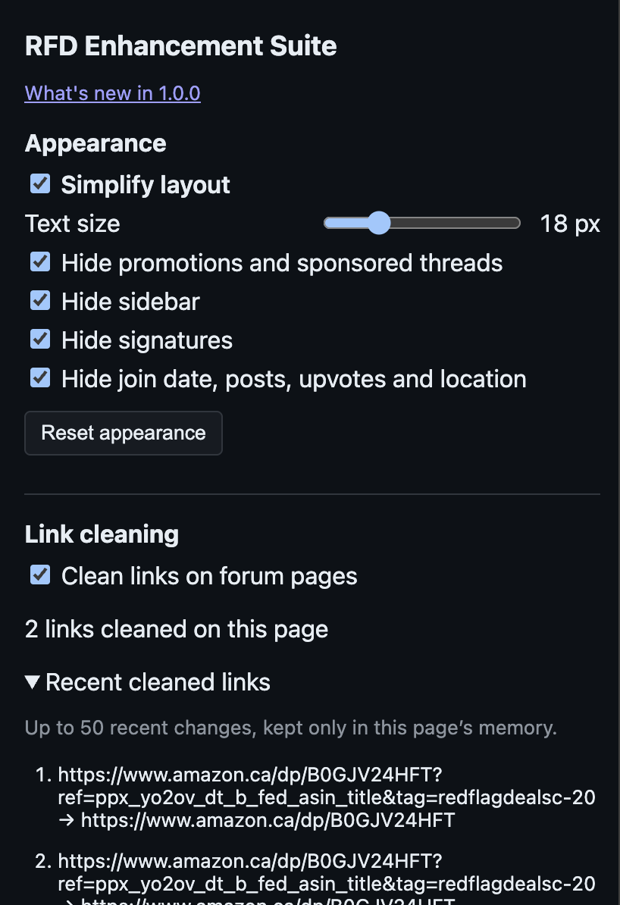

# RFD Enhancement Suite

Give [RedFlagDeals forums](https://forums.redflagdeals.com/) a simpler interface for Hot Deals lists and discussion threads, and clean supported affiliate redirects and tracking parameters from forum links. Layout improvements and link cleaning are independent and both on by default.

[Firefox store listing](https://addons.mozilla.org/en-US/firefox/addon/rfd-redirect-stripper/) · [Chrome store listing](https://chromewebstore.google.com/detail/rfd-affiliate-stripper/nhjomcijhonhoggkckbjjfnjdcefbblo)

Version 1.0.0 is available from source. Store listings may take time to update after submission and review.

## Appearance

The extension makes small layout changes to Hot Deals card listings and discussion threads: it uses the available page width and puts rows and posts flush together. Classic Hot Deals lists keep their native rows and controls while the sidebar setting works there too. RFD controls page colours and light/dark mode; this extension changes layout and visibility. It keeps RFD's links, filters, pagination, posting controls, thread order, timestamps and emoji sizing. Search, account, profile, forum directory and unknown page layouts retain RFD's native appearance.

| Popup control | Default | Effect |
| --- | --- | --- |
| Simplify layout | On | Use more of the page width and place deal rows and posts together on supported pages. Turn this off for link cleaning alone. |
| Text size | 18 px | Adjust discussion and quoted text from 16 to 24 px with a slider. Reply details and Hot Deals list titles and metadata scale with it. |
| Hide promotions and sponsored threads | On | Hide recognized ads, sponsored placements and labeled sponsored threads in both Hot Deals list layouts, including pencil ads and the member header leaderboard. This changes display; it does not block requests. |
| Hide sidebar | On | Hide sidebars on card lists, classic Hot Deals lists and threads, using the freed space. On card lists, RFD's filters remain available through More Filters. Turn it off to restore RFD's sidebar spacing. |
| Hide signatures | Off | Show signatures present in the page by default. Turn it on to hide them. |
| Hide join date, posts, upvotes and location | Off | Optionally hide those profile details on deal posts and replies; names and ranks remain. |



Appearance settings persist across supported tabs. **Reset appearance** restores only these defaults. Turning Simplify layout off leaves link cleaning and the signature switch at their own settings. RFD may omit signature markup for some posts or page states; the extension can only show signatures present in the page.

The popup links to the 1.0.0 update page. When an installed extension updates to version 1.0.0, that page opens once in a new tab. Reloading an unpacked extension without changing its version does not reopen it.

### Quick test in Brave

1. Open `brave://extensions` and turn on **Developer mode**.
2. Select **Load unpacked** and choose this checkout's folder, the one containing `manifest.json`. No build or package is needed.
3. Open or reload `https://forums.redflagdeals.com/hot-deals-f9/`, then open a deal thread. The layout improvements should appear by default.
4. Use the popup to change layout improvements, signatures and link cleaning independently. After editing source files, reload the extension on `brave://extensions` and refresh the forum tab.

To use link cleaning alone, turn **Simplify layout** off. To use only the visual changes, turn **Clean links on forum pages** off.

## How it works

When link cleaning is on, the extension checks forum post links against its [redirect rules](redirects.json). For example, a `go.redirectingat.com` link containing an encoded Amazon product URL is replaced with the direct `amazon.ca/dp/...` link. Amazon rules also remove selected tracking parameters while preserving unrelated query values, seller and variant information, and URL fragments. Search keywords remain on Amazon search pages.

Only matching links are changed. The extension checks links in forum posts and deal buttons, and updates visible link text when it is the full original URL. Turning cleaning off stops new rewrites and restores links previously changed by the extension when the site has not changed them since. Turning it back on resumes cleaning. If you installed the extension while an RFD tab was already open, reload that tab to activate it.

## Using the popup

- **Cleaned links:** Shows how many distinct links were cleaned on the current forum page. Expand **Recent cleaned links** to see up to 50 recent original and cleaned URL pairs. This history lives in the page's memory and clears when link cleaning is turned off or the page reloads.
- **Clean links on forum pages:** Controls automatic rewrites independently of appearance settings. It is on by default.
- **Test a link:** Paste an HTTP or HTTPS URL to preview the result and each rule applied. The tester does not open the destination. It reports invalid URLs and warns if cleaning stops at a cycle or the 20-step limit.
- **Rules status:** Shows the last successful rules update or an update error. Bundled rules are available before the first successful download and when there is no usable cached configuration.
- **Config URL:** Enter the URL of a trusted JSON rules file and select **Save** to validate and use it. **Reset** restores the default URL. Reload open forum pages after changing rules; the popup tester uses the current rules immediately.

The extension checks for updated rules hourly. If a download or validation fails, it keeps the last valid rules and shows the error in the popup.

## Running from source

Requires Node.js and npm. To run the extension in Firefox during development:

```sh
npm ci
npm run start:firefox
```

To run the checks and build a package in `web-ext-artifacts/`:

```sh
npm test
npx playwright install chromium firefox
npm run test:browser
npm run lint
npm run build
```

## Contributing redirect rules

Rules live in [redirects.json](redirects.json). Open a pull request to add or update a rule. To try rules from your branch, set **Config URL** in the popup to its raw JSON file, for example:

```text
https://raw.githubusercontent.com/davegallant/rfd-affiliate-stripper/my-new-branch/redirects.json
```

The file must contain a JSON array. Every rule needs a regex `pattern` with a named `baseUrl` capture group. An optional `name` labels it in the link tester. Supported operations are:

| Field | Effect |
| --- | --- |
| `destinationParam` | Read the destination URL from this query parameter. |
| `removeParams` | Remove the listed query parameters while preserving the encoding of retained values. |
| `removePathRef` | Remove a trailing `/ref=...` path segment. |

These operations run only when the rule's pattern matches. Rules using only a regex remain supported. The extension accepts only HTTP or HTTPS destinations and stops after 20 cleaning steps or a cycle. Use trusted rule sources: validation and redirect limits do not bound the runtime of an individual regex. [regex101.com](https://regex101.com/) can help test a pattern.

## Tampermonkey userscript

The project began as a [Tampermonkey](https://www.tampermonkey.net/) userscript. You can copy [script.js](script.js) into Tampermonkey if you prefer that format. It contains the cleaning rules and URL preservation logic, but the browser extension provides dynamic link monitoring, rule updates, and the popup.

## Store publishing

The [publish workflow](.github/workflows/publish.yaml) runs for `v*` tags and can be started manually with an existing tag. The tag must match the version in [manifest.json](manifest.json). It runs tests and linting, builds the package, and submits to stores whose credentials are configured. Store review may still be required before a version becomes public.

For future releases, complete the [live browser release checks](docs/testing/modern-rfd-manual.md), update the manifest version and changelog, then tag the release.

Complete the store listings in their dashboards, then add these GitHub Actions secrets:

| Store | Required secrets |
| --- | --- |
| Chrome Web Store | `CWS_CLIENT_ID`, `CWS_CLIENT_SECRET`, `CWS_REFRESH_TOKEN`, `CWS_PUBLISHER_ID`, `CWS_EXTENSION_ID` |
| Firefox Add-ons | `AMO_JWT_ISSUER`, `AMO_JWT_SECRET` |

Chrome uses an OAuth client and refresh token with the `chromewebstore` scope, plus IDs from the Chrome Developer Dashboard. Firefox uses an AMO API key and secret. A store's publishing job is skipped until all its secrets are present.
